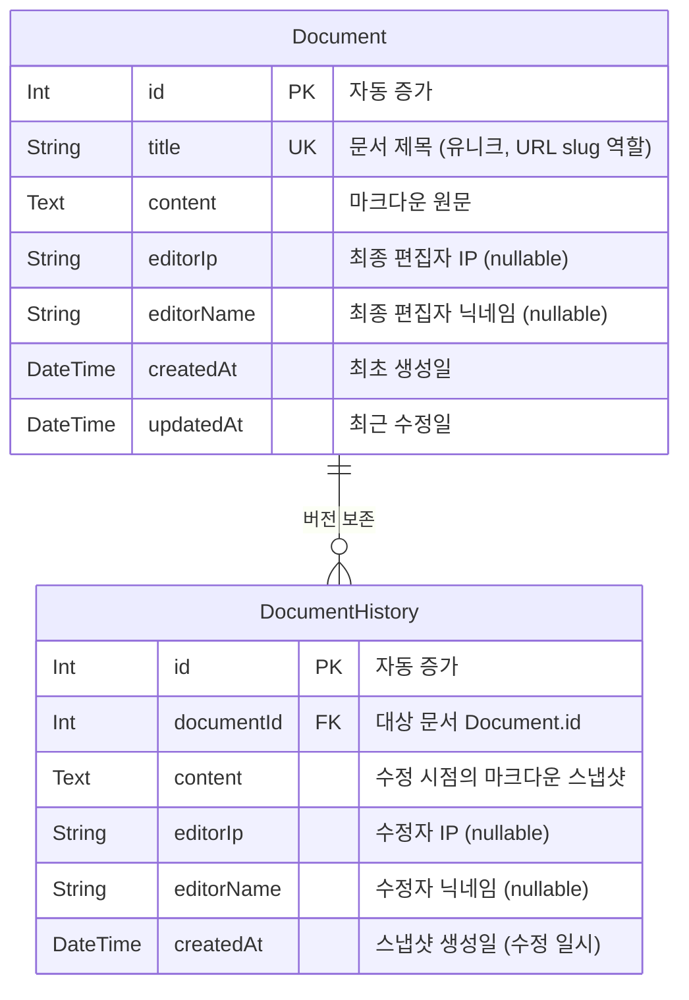
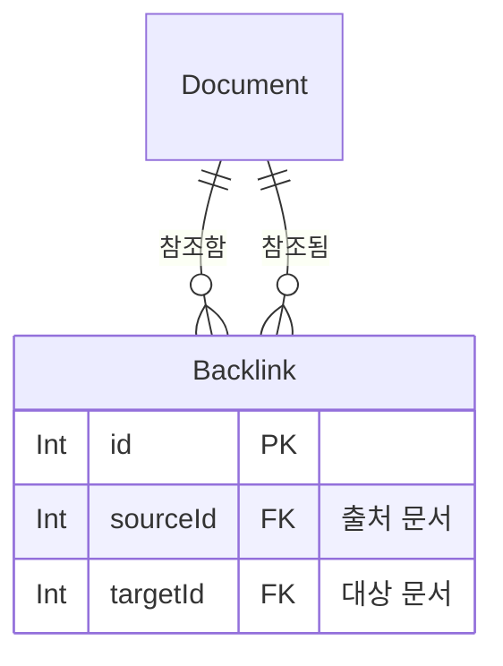

# ERD (Entity Relationship Diagram)

> 이 문서는 YesoWiki의 데이터 모델을 정의합니다.
> **SSOT 원칙에 따라 `prisma/schema.prisma`가 실제 DB 진실 공급원(Source of Truth)이며, 이 ERD는 그 시각적 설명 문서입니다.**
> 스키마 변경 시 반드시 이 문서도 함께 업데이트해야 합니다.

## 엔티티 관계 다이어그램

## 주요 설계 결정 사항

| 항목 | 결정 | 이유 |
|------|------|------|
| `User` 모델 | **제거** | 나무위키와 동일하게 로그인 없이 익명 편집 정책 채택 |
| `editorIp` / `editorName` | nullable String | IP는 서버에서 자동 기록, 닉네임은 사용자가 선택적으로 입력 |
| `Document.title` | `@unique` 제약 | 문서 제목이 URL이자 식별자. `[[백링크]]`도 제목 기준으로 동작 |
| `DocumentHistory.content` | 전체 본문 스냅샷 | diff가 아닌 원본 전체를 저장하여 임의 시점 복원 및 반달리즘 복구 가능 |
| `onDelete: Cascade` | DocumentHistory | 문서 삭제 시 히스토리도 함께 제거 |
| 소프트 삭제 | 미구현 (향후 확장) | 현재는 히스토리만 보존. 필요 시 `deletedAt DateTime?` 컬럼 추가 예정 |

## 향후 확장 예정 모델

향후 기능 확장 시 추가될 수 있는 모델입니다. (미구현)

